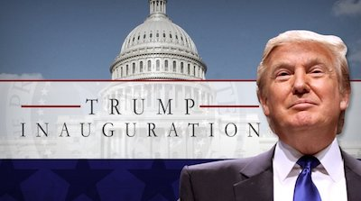

# Spring 2018
# Project 1: What did the presidents say at their inauguation?



### [Project Description](doc/)
This is the first and only *individual* (as opposed to *team*) this semester. 

Term: Spring 2018

+ Projec title: "Economic expansions, recessions and wars -- how these historic events can affect presidents' inaugural speeches"
+ This project is conducted by Ziyu Chen

+ Project summary: This project aims at discorvering how historic events can affect presidents' inaugural speeches made during those events. In this project, I focus on three types of historic events in modern history -- wars, major economic recessions and economic expansions. Specifically, those events include World War I, World War II, the Great Depression, the Great Recession, the longest and the second longest economic expansions in US history.  
I found that regardless of the types of events, the most expressed emotion in all speeches is "trust". During economic expansion periods, there are a lot more "joy" and "surprise" and less "fear" and "anger"expressed in the inaugural speeches overal, compared to recession and war periods.  
The national economic status can have an influence on the emotions expressed in the inaugural speeches. Emotions expressed in speeches made during economic expansions and economic recessions are different.
Presidents tend to talk about different topics in different historical backgrounds. For example, during economic expansion, they like to talk about "freedom", "family", "national security" and etc. During recessions, they like to talk about "jobs", "reforms" and etc to show their future plans to revitalize economy. During wars, they like to talk about "cohesion", "responsibility" and etc. to encourage the nation to stick together.
All speeches made during expansions are clustered together and most of the speech made during wars are clustered together. This indicates that types of events during which the speeches are made potentially can determine what topics the presidents are going to talk about in their inaugural speeches.  


Following [suggestions](http://nicercode.github.io/blog/2013-04-05-projects/) by [RICH FITZJOHN](http://nicercode.github.io/about/#Team) (@richfitz). This folder is orgarnized as follows.

```
proj/
├── lib/
├── data/
├── doc/
├── figs/
└── output/
```

Please see each subfolder for a README file.
